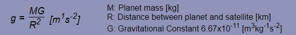

# Satellite Launch Simulation

This is a numerical simulation of a satellite's behavior going around the planet, created based on a formula for gravity. You can try it in various situations.

This is made only with [`JavaScript`](https://developer.mozilla.org/docs/Web/JavaScript) and [`jQuery`](https://jquery.com/).

## Run the Project

Clone the repo in your local machine and open `index.html` in your browser with local server environment.\
(ex. Open it with `Live Server` of `VS code`)

## Project Description

This is a numerical satellite-launch simulation built based on the formula for gravity shown below. 

This simulation is to simulate how the artificial satellite goes around the planet depending on parameters you set. 
To try simlation, input launch velocity and altitude on the left side. 
Simulation will start sa soon as you click "Launch" button and you can see how the satellite behaves. 

You can also select the planets from many selections by clicking the arrow on the top. 
The satellite will behave differently depending on the parameters and planet you set.
